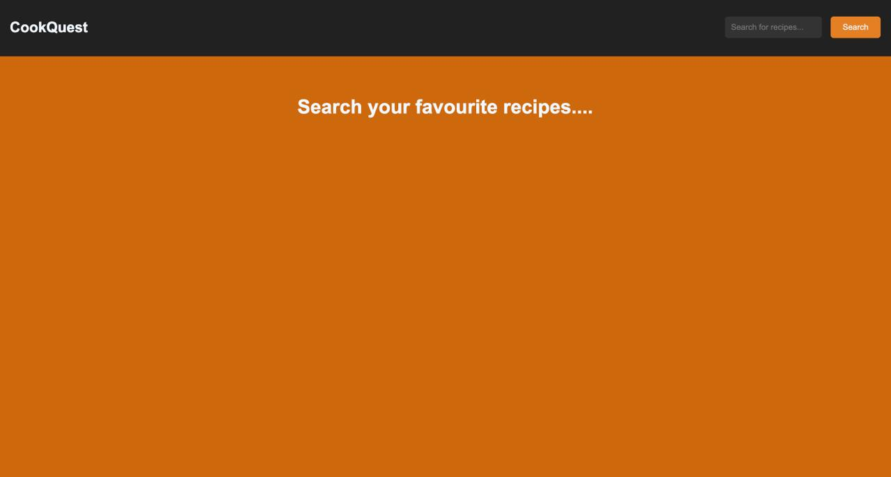
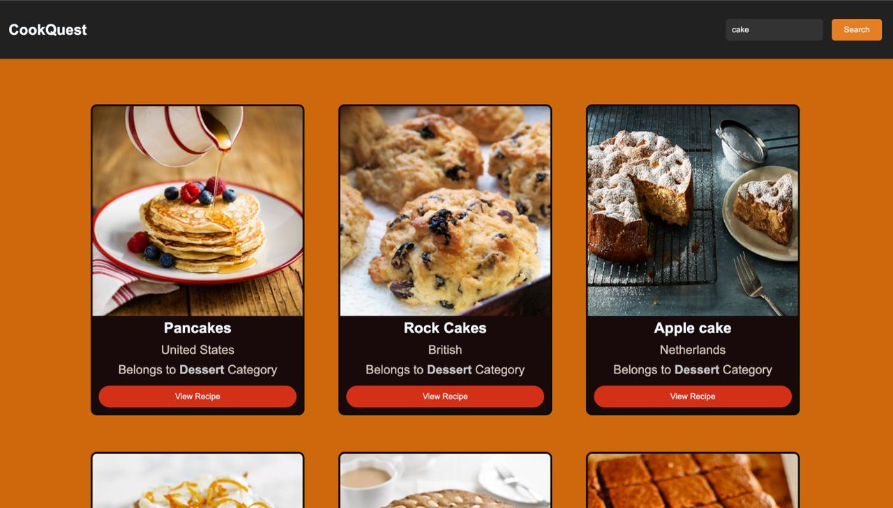
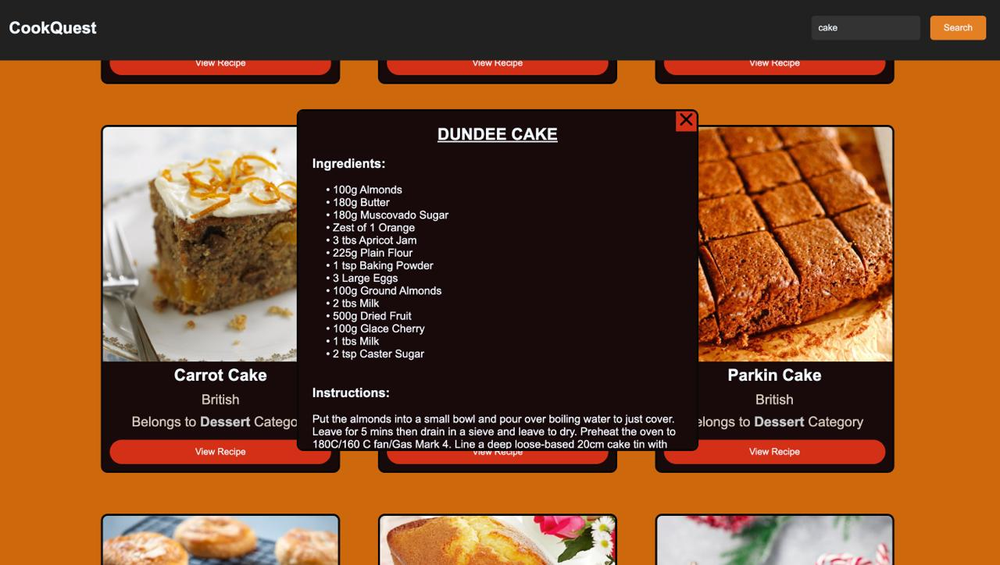

# 🍽️ CookQuest – Recipe Finder App

A modern **Recipe Search Application** built using **HTML, CSS, and JavaScript** that allows users to discover delicious recipes from around the world.

Search any dish, explore recipe cards, and view detailed ingredients and cooking instructions in an interactive popup.

---

## 📸 Preview

<p align="center">
  
  <br><br>
  
  <br><br>
  
</p>

---

## 🚀 Features

- 🔍 Search recipes instantly
- 🍰 Find recipes by dish name
- 🖼️ Beautiful recipe cards with images
- 🌍 Displays recipe origin/cuisine
- 📂 Shows recipe category
- 📋 Detailed ingredients list
- 👨‍🍳 Step-by-step cooking instructions
- 🪟 Interactive popup modal for recipe details
- 📱 Responsive and clean user interface
- ⚡ Fast and lightweight application

---

## 🛠️ Tech Stack

- **HTML5**
- **CSS3**
- **JavaScript (ES6)**
- **MealDB API**

---

## 📂 Project Structure

```bash
CookQuest/
│── image1.jpeg
│── image2.jpeg
│── image3.jpeg
│── index.html
│── style.css
│── script.js
```

---

## 🎯 How It Works

1. Enter the name of a recipe in the search bar.
2. Click the **Search** button.
3. Browse through the matching recipes.
4. Click **View Recipe** on any recipe card.
5. Read ingredients and cooking instructions in the popup window.

---

## 🌟 Highlights

- Modern card-based layout
- Attractive orange-themed design
- Dynamic recipe fetching using API
- User-friendly recipe exploration experience
- Easy-to-understand code structure for beginners

---

## 💡 About the Project

CookQuest was built as a web development project to practice:

- API Integration
- DOM Manipulation
- Event Handling
- Responsive UI Design
- JavaScript Async/Await

The project demonstrates how to fetch real-time recipe data from an external API and present it in a visually appealing format.

---

## 👨‍💻 Developer

**Yug Thakral**

Passionate about learning Web Development, Data Structures & Algorithms, and building interactive web applications.

---

## 🤝 Connect With Me

<p>
  <a href="https://www.linkedin.com/in/yug-thakral-a38252317/" target="_blank">
    
  </a>
</p>

---

## ⭐ Support

If you liked this project, consider giving it a **⭐ Star** on GitHub. It helps and motivates me to build more awesome projects!

Happy Cooking! 🍳✨

